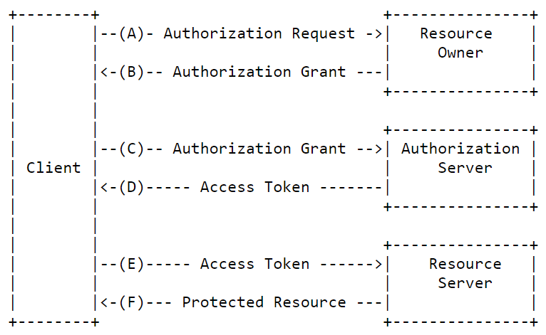
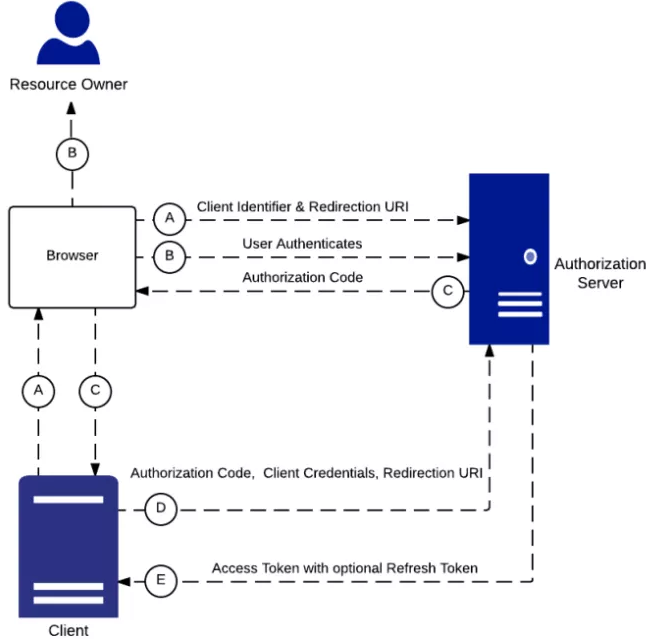
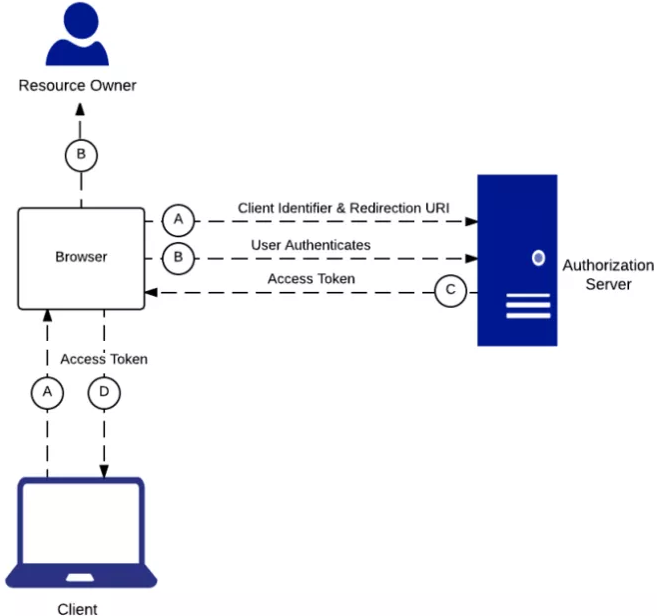

# Secure Coding 2017 - Azonosítás és engedélyezés

## Feladat: OAuth alkalmazása gyakorlatban 

* A Temboo segítségével alapvető információk lekérdezése a felhasználóról.
* A labor során egy Android alkalmazást kell készíteni, amely a Facebook OAuth2 API-ját felhasználva engedélyt kér a felhasználó erőforrásaihoz, majd lekérdez néhány információt a felhasználóról.

## Előkövetelmények a labor teljesítéséhez:

* Facebook account (www.facebook.com) (Aki nem szeretné a labor gépeken megadni a bejelentkezési adatait, vagy nem rendelkezik Facebook fiókkal, akkor használja a laborvezető által adott teszt felhasználót)
* Temboo account (www.temboo.com)

## Áttekintés



Az OAuth engedélyezés során általánosságban a felhasználótól engedélyt kérünk az erőfforásainak elérésére, amelyet ha megad, valamilyen engedélyezési kódot kapunk (A-B), az engedélyezési kódot hozzáférési tokenre cseréljük (C-D), majd a hozzáférési token segítségével hozzáférhetünk a felhasználó erőforrásaihoz (E-F).

## Grant típusok, OAuth flow-k

### Authorization Grant



Az Authorization Grant vagy Server Side Flow szerver alkalmazásokhoz lett tervezve. A felhasználói engedély után a szerver egy Authorization kódot küld, melyet a kliens a Client ID és Client Secret komponensekkel együtt access tokenre cserél (szerver hívásokon keresztül, tehát a hozzáférési token és a Client Secret rejtve marad a felhasználó szemszögéből). A Refresh Token támogatott.

A (többek között Facebook OAuth) folyamat szemléltetésére és kipróbálására nagyon jó felületet nyújt a TEMBOO nevű weboldal:
https://temboo.com

Regisztráció után nyissuk meg a Facebook-hoz kapcsolódó szolgáltatásaikat:
https://temboo.com/library/Library/Facebook/

Kövessük a **Setup Instructions** részben leírtakat (amennyiben nem szeretné a labor során a Facebook fiókját használni, ez a lépés kihagyható, de kísérje figyelemmel a lépéseket!):
* Facebook developer account készítése
* Facebook app készítése **Facebook developer console**-ban
* **Website** platform option választása
* **Site URL** beállítása (http://{accountname}.temboolive.com/callback/)
* **Add product** Facebook Login (Platform legyen Android)
* **Facebook Login > Client OAuth Settings**, Temboo callback URL megadása a **Valid OAuth redirect URIs** mezőbe:

https://{ACCOUNT_NAME}.temboolive.com/callback/
--- |

* **Settings > Basic > App Domains** mezőbe ugyanezt

Ezekkel a beállításokkal a Temboo profil/webalkalmazás került összekötésre a Facebook alkalmazással. A Temboo a *Facebook App ID* értékből tudja elindítani a kéréseket a Facebook App felé, a Facebook App pedig a *callback url*-en keresztül tudja a válaszokat visszajuttatni a Temboo-nak.

A következő feladathoz érdemes az alábbi 3 linket egymás mellé sorban megnyitni a böngészőben:

* https://temboo.com/library/Library/Facebook/OAuth/InitializeOAuth/ **(1/3)**
* https://temboo.com/library/Library/Facebook/OAuth/FinalizeOAuth/ **(2/3)**
* https://temboo.com/library/Library/Facebook/Reading/User/ **(3/3)**

Az első és második linken töltse ki az **AppID** illetve az **AppID/AppSecret** mezőket a Facebook alkalmazás adataival. (Érdemes elmenteni a jobb felső gombbal profilba, hogy ne kelljen később ismét beilleszteni!)

#### 1. Engedély kérése

Az alábbi linken (1/3) indítsa el az OAuth folyamatot:

https://temboo.com/library/Library/Facebook/OAuth/InitializeOAuth/

* Adja meg a Facebook alkalmazása App ID értékét (https://developers.facebook.com/apps/)
* A **Scope** mezőt hagyjuk üresen (default érték = nyilvános profil)
* Az **AuthorizationURL** mezőben található az engedélykérő link, nyissuk meg, jelentkezzen  be Facebook fiókjába (vagy a laborvezetőtől kapott teszt felhasználóba), majd engedélyezzük a nyilvános profil elérését az alkalmazásnak.

Ilyenkor egy *Authorization Code*-t kap válaszként a Temboo, melyet eltárol.

#### 2. Authorization Code kicserélése Access Token-re

A következő link (2/3) segítségével cseréljük ki az *Authorization Code*-ot *Access Token*-re.

https://temboo.com/library/Library/Facebook/OAuth/FinalizeOAuth/

Ismét adja meg az **AppID** és **AppSecret** értékeit a Facebook alkalmazásból, illetve adja meg az előző (Engedély kérése) hívás során kapott *CallbackID* értéket is (az 1/3 link egyik mezőjéből olvasható), amelyben a Temboo tárolja az előzőleg kapott *Authorization code*-ot

Egy új mezőben megjön válaszul az *Access Token*-t, ami már felhasználható a felhasználó erőforrásainak (a felhasználó által deklarált hatókörű) elérésére.

#### 3. Erőforrás elérése az Access Token segítségével

Kérje le a felhasználó adatait a kapott *Access Token* segítségével az alábbi linket (3/3) használva!

https://temboo.com/library/Library/Facebook/Reading/User/

A **Fields** mezőt hagyja alapértelmezetten (*id, name*), a **ResponseFormat** mezőbe viszont írjon *xml*-t, így az ékezetek is megjelennek a válaszban.

Figyelje meg, ha a 3-as lépésben megpróbáljuk az alapértelmezett **Fields mezőben** az *id,name,email* adatokat lekérni, azt tapasztalja, hogy csak az *id* és *name* értéket kapja meg így is.

**Miért?**

**Válasz:**

Azért, mert az email lekérdezéséhez nem elég az alap jogosultsági körrel rendelkező *Access Token*.

Ha bővebb hatáskörű *Access Token*-re van szükség, bővíteni kell az 1. lépés **Scope** mezőjét a megfelelő *Permission* értékekkel.

#### Önálló feladat

Generáljon Access Token-t, amivel már lekérdezhető a felhasználó email címe is!

Segítség:

https://developers.facebook.com/docs/facebook-login/permissions/v2.0

(Scope bővítése a megfelelő engedéllyel, Fields mezőbe a lekérdezendő paraméter, többi lépés ugyanaz.)

### Implicit Grant



Az Implicit Grant kliens oldali alkalmazásokhoz lett tervezve, mint például egy böngészőben futó JavaScript. Miután az egész alkalazás kód hozzáférhető, a Client Secret nem tárolható kliens oldalon. A kliens authentikációra azonnal megérkezik az Access Token. Ez a flow nem támogatja a Refresh Token-eket, ha az Access Token lejár, újat kell kérni.

#### Előkészületek:
* Törölje az alkalmazás felhasználótól kért engedélyeit! (Legegyszerűbben belép a fiókjába/teszt felhasználó fiókjába, akitől az alkalmazás engedélyeket kért, majd beállítások > alkalmazások, és az X segítségével távolítsa el az alkalmazást. **Vigyázat**, ne a Developer Console-ból törölje az alkalmazást, hiszen az alkalmazásra továbbra is szükség lesz, hanem a felhasználó alkalmazásai közül, tehát amik engedélyt kértek a felhasználó adatlapjához, abból a listából!)
* Nyissa meg az Android Studio-t, és Open Project opciót választva nyissa meg a következő [kiinduló projekt](./assets/start.zip)et!
* Tekintse át laborvezető segítségével a projekt felépítését!

#### Facebook bejelentkezés integráció

Az *Android Facebook SDK* használatához adja hozzá a következő függőséget a *build.gradle (Module: app)* fájlhoz a *dependencies* tag-be:

```xml
compile 'com.facebook.android:facebook-login:[4,5)'
```

Nyissa meg az *AndroidManifest.xml* fájlt, és az *application* tagen belülre adja hozzá az alábbi konfigurációt:

```xml
<meta-data
   android:name="com.facebook.sdk.ApplicationId"
   android:value="@string/facebook_app_id" />

<activity
   android:name="com.facebook.FacebookActivity"
   android:configChanges="keyboard|keyboardHidden|screenLayout|screenSize|orientation"
   android:label="@string/app_name" />
<activity
   android:name="com.facebook.CustomTabActivity"
   android:exported="true">
   <intent-filter>
      <action android:name="android.intent.action.VIEW" />

      <category android:name="android.intent.category.DEFAULT" />
      <category android:name="android.intent.category.BROWSABLE" />

      <data android:scheme="@string/fb_login_protocol_scheme" />
   </intent-filter>
</activity>
```

A konfiguráció hivatkozik két szöveges erőforrásra, amelyeket a *strings.xml* fájlba vegyen fel, behelyettesítve a Facebook alkalmazás APPID értékét!

```xml
<string name="facebook_app_id">APPID</string>
<string name="fb_login_protocol_scheme">fbAPPID</string>
```

Engedélyezzük az alkalmazás Internet elérést az alábbi engedéllyel: (*AndroidManifest.xml manifest* tag-en belülre)

```xml
<uses-permission android:name="android.permission.INTERNET" />
```

Adjon hozzá egy Facebook Login gombot a felülethez! (*activity_main.xml RelativeLayout* tag-be)

```xml
<?xml version="1.0" encoding="utf-8"?>
<RelativeLayout android:id="@+id/activity_main"
   xmlns:android="http://schemas.android.com/apk/res/android"
   xmlns:tools="http://schemas.android.com/tools"
   android:layout_width="match_parent"
   android:layout_height="match_parent"
   android:paddingBottom="@dimen/activity_vertical_margin"
   android:paddingLeft="@dimen/activity_horizontal_margin"
   android:paddingRight="@dimen/activity_horizontal_margin"
   android:paddingTop="@dimen/activity_vertical_margin"
   tools:context="hu.bme.securecoding.oauthexample.MainActivity">

   <com.facebook.login.widget.LoginButton
      android:id="@+id/login_button"
      android:layout_width="wrap_content"
      android:layout_height="wrap_content"
      android:layout_gravity="center_horizontal"
      android:layout_marginTop="30dp"
      android:layout_marginBottom="30dp" />

</RelativeLayout>
```

Végül jelenítse meg log üzenetben a bejelentkezés eredményét!

```java
public class MainActivity extends AppCompatActivity {

   private static final String LOG_TAG = "secure_coding_oauth";

   private CallbackManager callbackManager;

   @Override
   public void onCreate(Bundle savedInstanceState) {
      super.onCreate(savedInstanceState);
      setContentView(R.layout.activity_main);
      facebookSDKInitialize();

      final LoginButton loginButton = findViewById(R.id.login_button);
      loginButton.registerCallback(callbackManager, facebookCallback);
   }

   protected void facebookSDKInitialize() {
      callbackManager = CallbackManager.Factory.create();
   }

   @Override
   protected void onActivityResult(int requestCode, int resultCode, Intent data) {
      super.onActivityResult(requestCode, resultCode, data);
      callbackManager.onActivityResult(requestCode, resultCode, data);
   }

   private FacebookCallback<LoginResult> facebookCallback = new FacebookCallback<LoginResult>() {
      @Override
      public void onSuccess(final LoginResult loginResult) {
         if (loginResult.getAccessToken() != null && loginResult.getAccessToken().getPermissions() != null) {
            String accessTokenPermissions = "";
            for (final String permission : loginResult.getAccessToken().getPermissions()) {
               accessTokenPermissions += permission + "\n";
            }
            Log.d(LOG_TAG, "Login successful! Access token permissions:\n" + accessTokenPermissions);
         } else {
            Log.d(LOG_TAG, "Login successful! No permissions!");
         }
      }

      @Override
      public void onCancel() {
         Log.d(LOG_TAG, "Login onCancel");
      }

      @Override
      public void onError(final FacebookException error) {
         Log.d(LOG_TAG, "Error! \n" + error.toString());
      }
   };
}
```

**Próbálja ki az alkalmazást emulátor segítségével! A login gombot megnyomva jelentkezzen be!**

(Egyelőre semmi nem fog még történni, hiszen authentikáció hatására az Android alkalmazásunk egy Access Token-t kapott a default jogosultságkörrel.)

#### Kérdezze le a felhasználó nevét és azonosítóját! (name, id)

Használja fel az előző lépésben implementált Facebook Login funkció által biztosított Access Token-t a felhasználó nevének és azonosítójának lekérdezésére!

A funkciót végző metódus:

```java
private void getUserNameAndId(final AccessToken accessToken) {
   GraphRequest request = GraphRequest.newMeRequest(
         accessToken,
         new GraphRequest.GraphJSONObjectCallback() {
            @Override
            public void onCompleted(
                  JSONObject object,
                  GraphResponse response) {
               Log.d(LOG_TAG, object.toString());
               try {
                  Toast.makeText(MainActivity.this, "Welcome " + object.getString("name"), Toast.LENGTH_SHORT).show();
               } catch (JSONException e) {
                  e.printStackTrace();
               }
            }
         });
   Bundle parameters = new Bundle();
   parameters.putString("fields", "id,name");
   request.setParameters(parameters);
   request.executeAsync();
}
```

Figyelje meg, hogyan kerül beállításra, hogy mely felhasználói attribútumokat kéri le a *Request*!

Hívja meg az előző metódust az *onSuccess* bekövetkezésekor: (*onSuccess*-be)

```java
getUserNameAndId(loginResult.getAccessToken());
```

**Próbálja ki az alkalmazást!**

#### Önálló feladat

Bővítse az alkalmazást úgy, hogy az alkalmazás a felhasználó email címét is lekérdezze!

Segítség:

*Request* által lekérdezett attribútumok bővítése:

```java
parameters.putString("fields", "id,name");
```

A Login gomb által igényelt Access Token default scope bővítése:

A felhasználó email címe nem látszódik, hiszen a Login gomb default jogosultságú Access Token-t igényel, amelybe az email cím nem tartozik bele.
